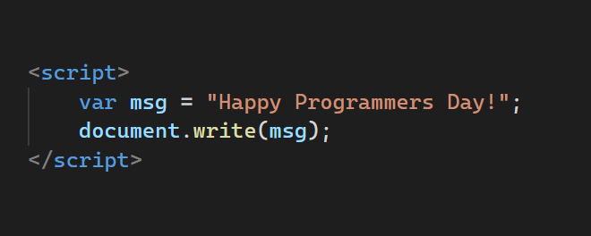

> Cada día 256 del año se celebra a nivel mundia el Día del Programador en honor a los que línea de código por línea de código han cambiado el mundo. En este artículo hablaremos de su historia.

### ¿Por qué cada día 256?
Para muchos el número 256 es un simple número, pero para los Programadores y Ciéntificos Computacionales este número tiene un gran significado. En algún momento, los primeros diseñadores de la computadora binaria idearon el byte como la siguiente unidad estándar por encima de un bit. Un byte se define como 8 bits y puede representar valores de 0 a 255, o 2 a la potencia de 8 valores diferentes. Un byte representa **256** valores diferentes. 

```bash
1 byte = 256 caracteres
```

Gracias a los bytes nuestra computadora puede representar millones y millones de unidades de información en segundos. En cualquier caso, 256 es especial ya que representa la unidad base más común en una computadora, por eso el **Día Mundial del Programador se celebra cada día 256**.

### Historia del Día del Programador 👨‍💻
> El Día del Programador nace en Rusia, gracias a dos programadores

En 2002, los programadores rusos Valentin Balt y Michael Cherviakov de Parallel Technologies reunieron firmas con la esperanza de que el gobierno ruso declarara el Día de los Programadores. No fue sino hasta 2009 que el Ministerio de Medios de Comunicación y Comunicaciones de Rusia anunció el feriado oficial. El presidente Dmitry Medvedev de Rusia firmó el proyecto de ley en honor a los programadores de computadoras el 11 de septiembre de 2009.

### ¡Felicidades! Programadores de todo el mundo 🎉🎉
El día honra a los programadores de todo el mundo. Difícilmente hay una persona en el mundo civilizado que no se beneficie de las herramientas hechas por los programadores. Ya sea que miremos el transporte o la medicina, las finanzas o la educación, la programación influye en todos ellos. Casi todas las empresas importantes requieren que los programadores mantengan su infraestructura desde el punto de vista de tecnólogico. Las telecomunicaciones siguen avanzando gracias a los programadores. La industria del automóvil confía en programadores para que las últimas marcas salgan de las líneas de montaje. La seguridad, la sociedad y el entretenimiento buscan en los programadores lo último en protección, diseño e innovación.

> En las circunstancias actuales gracias a herramientas y programas creados por programadores podemos seguir estudiando, mantenernos conectados con nuestros amigos y disfrutar de nuestros días en casa. Si conoces a un programador, felicitalo! 🎉🎉🎉

### #DayOfTheProgrammer Code Challenge
¡Demuestra tus habilidades como programador resolviendo este [Code Challenge](https://www.hackerrank.com/challenges/day-of-the-programmer/problem)!