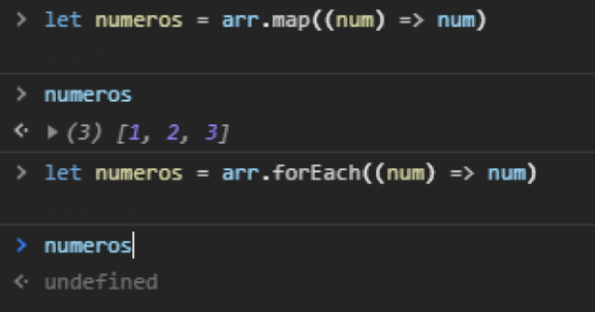
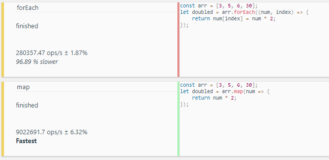

> Todo javascripter alguna vez ha usado los array methods: `.map()` y `.forEach()`. Para algunos podrian ser lo mismo. En este post aprenderemos la diferencia, casos de uso y al final haremos una comparativa de performance entre ellos.

### Definicion
Extraida de [MDN Web Docs](https://developer.mozilla.org):

- El método `map()` crea un nuevo array con los resultados de la llamada a la función indicada aplicados a cada uno de sus elementos.

- El método `forEach()` ejecuta la función indicada una vez por cada elemento del array.

Concluimos entonces que `map()` crea un nuevo arreglo con los resultados de la función aplicada, mientras que `forEach` no devuelve nada.

Como podemos notar, `map()` al asignarlo en una variable, nos retorna un nuevo arreglo de numeros, pero `forEach()` al hacer lo mismo, nos retorna undefined.

### Programación funcional
Siguiendo los lineamientos de la programación funcional sería más adecuado utilizar `map()` ya que `map()` no afecta la información que le brindamos, sino que crea una nueva.

### Performance
Hicimos una pequeña prueba de performance en https://jsbench.me para notar cuál es más rápido realizando las mismas tareas:

Derrota aplastante para `forEach()`, siendo este un **96.89%** mas lento que `map()`.

La razón de esto es que `forEach()` itera en cada elemento la función que le pasemos, mientras que `map()` retorna una nueva colección de datos con los elementos iterados.

### ¿Cuál es mejor?

Eso dependerá de lo que quieras hacer.

Simplemente quieres iterar: `forEach()` es tu hombre. 

O, por otro lado, quieres realizar operaciones en tu colección de datos sin afectarla: usa `map()`. No simplemente es más rápido, sino que junto con el puedes usar otros metodos como `filter()`, `reduce()` y el mismo `map()`.

### Comentarios finales
¡Gracias por leer! Espero que esta comparativa te haya ayudado a entender la diferencia entre estos dos array methods.

¡No olvides suscribirte si quieres recibir más artículos como este!

