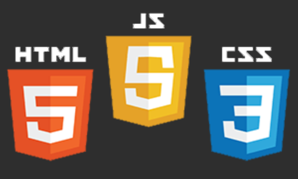

### Contenido del Curso
> En este curso aprenderás lo básico del lenguaje de marcado más importante: HTML, lo básico del formato de hojas de estilo en cascada más utilizado: CSS, y lo básico del lenguaje de programación que le da vida a cada página web: Javascript.

### [Click aquí para iniciar el curso ¡GRATIS!](https://www.youtube.com/playlist?list=PL1rI-YgjJRKrsZRGWE-8l6Lan7g5VdbRO)

### Temario
1. Breve charla acerca de cómo funciona internet y las páginas web.
2. Diferencia entre aplicación, sitio y página web.
3. Introducción a HTML.
4. Introducción a CSS.
5. Proyecto _'Mi primera página web'_ 😁
6. Introducción a Javascript.
7. Proyecto _'Calculadora'_ 🧮
8. Cooming soon (más contenido en construcción) 👷‍♂️🚧

